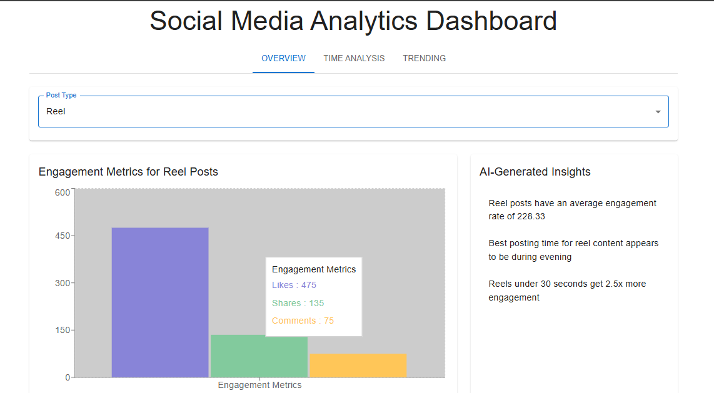
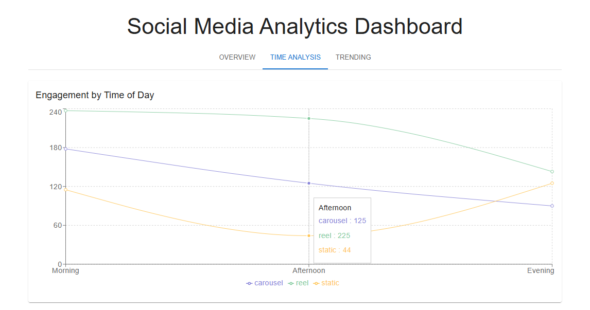
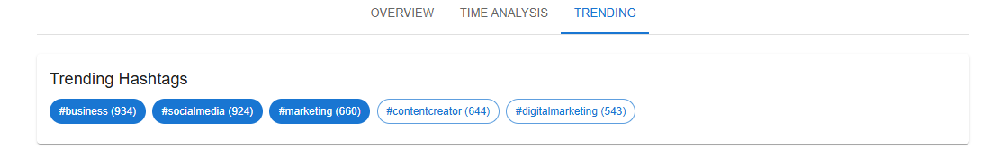

# 📊 Social Media Analytics Platform

A full-stack analytics platform that helps you **analyze and optimize your social media content performance** using **FastAPI**, **Google Gemini AI**, and **DataStax Astra DB**.

---

## 🚀 Features
✅ Post analytics: likes, shares, comments  
✅ AI-powered insights and content recommendations  
✅ Time-based analytics to find best posting times  
✅ Trending hashtags detection  
✅ Performance comparison across post types (carousel, reel, static)  

---
### 📸 Screenshots

|  |  | 
|------------------------|----------------------------|--------------------------|
---

## 🧰 Tech Stack
- **Backend:** FastAPI (Python)
- **AI:** Google Gemini API
- **Database:** DataStax Astra DB (scalable NoSQL)
- **Frontend:** React.js
- Async operations & clean architecture

---

## 🌱 Why DataStax Astra DB?
- Scalable NoSQL for large social data
- Fast read/write for analytics
- Easy integration with FastAPI
- Cost-effective & reliable

---

## 🛠️ Running the Application

### 1️⃣ Install dependencies

      pip install -r requirements.txt
      
### 2️⃣ Set up environment variables
Create a .env file with:

      API_HOST="0.0.0.0"
      API_PORT=8000
      DEBUG=True
      FRONTEND_URL="http://localhost:3000"
      GEMINI_API_KEY="your_gemini_api_key"
      DATASTAX_CLIENT_ID="your_client_id"
      DATASTAX_CLIENT_SECRET="your_client_secret"
      
### 3️⃣ Start the backend
      cd backend
      uvicorn main:app --reload

### 4️⃣ Start the frontend
      cd frontend
      npm install
      npm start

## 📦 Project Structure
      SocialMediaAnalysis/
      ├── backend/
      │ ├── main.py # FastAPI entry point
      │ ├── datastax_service.py # DB integration
      │ ├── db_config.py # DB config
      │ ├── requirements.txt
      │ └── .env.example
      ├── frontend/
      │ ├── public/ # index.html, favicon
      │ └── src/ # React components
      └── README.md

---

Made with ❤️ by Prasad 🚀
